## Windmetaverse-风元宇宙社区-[TTEE快指北](Readme.md)

[**新人问答**](新人问答.md) | [**新人指引**](新人指引.md) | **NFT市场** | [**游戏攻略**](游戏攻略.md) | [**关键词速递**](关键词速递.md) | [**近期关注**](近期关注.md)| **账户设置** | [**领取SOC**](领取SOC.md)

---

(本栏目实验性质, 信息准确度和即时性没有保证. 请以官宣为准. 除非具体说明, 均为北京时间.)
## 1，点击[官网](https://www.windmetaverse.com/)右上角“LANGUAGE”切换为中文

## 2，点击网页右上角“登录” 然后点击“连接钱包”
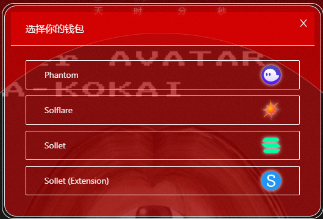

## 3，钱包连接成功后，再次点击右上角“登录”，然后选择“账户”

## 4，然后会弹出如下窗口，请点击“验证”
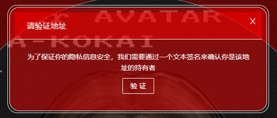

## 5，之后会弹出以下窗口，请点击“Approve”
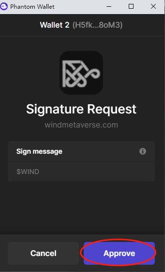

## 6，在这边查看你的化身
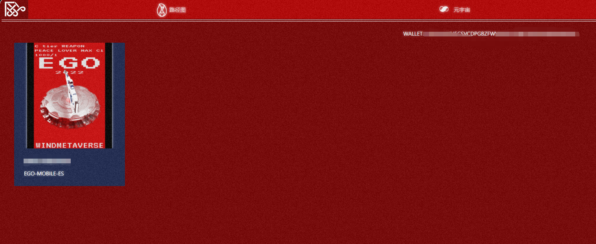

## 7，点击头像，然后点击“Enter Wind”
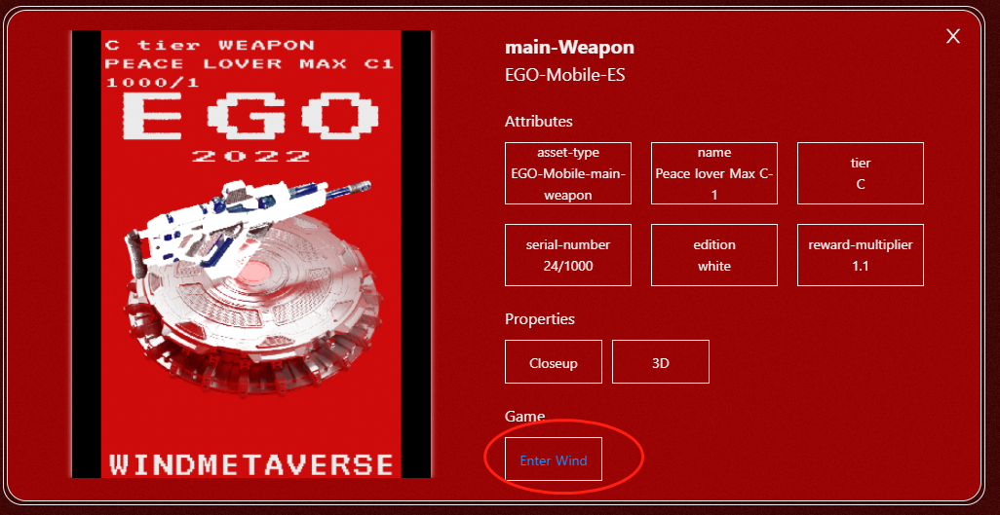

## 8，点击页面右上角“LANGUAGE”，点击语言切换ZH（中文），再点击页面中部的“验证”

## 9，这里会出现钱包连接页面，选择之前的钱包进行连接
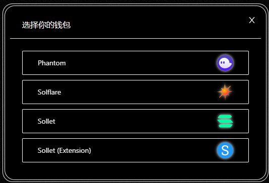

## 10，再次点击“Approve”

## 11，点击修改密码，化身“游戏账号”和修改后密码是游戏客户端登录信息，请收藏
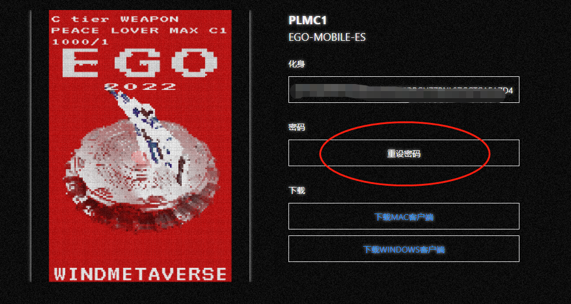

## 12，输入你要修改的密码
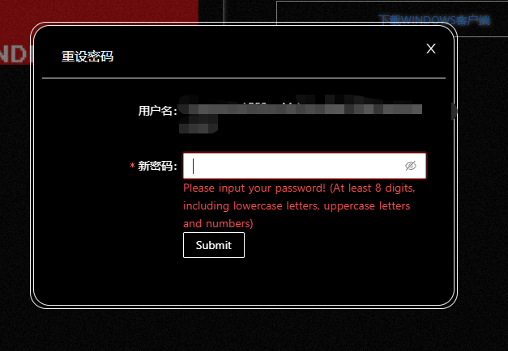

## 13,之后钱包会出现此页面，点击“Approve”确认
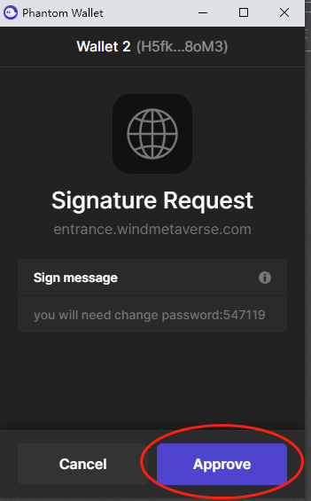

## 14，修改密码成功
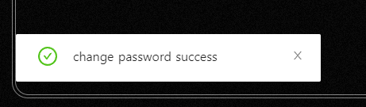

## 15, 点击下载Windows客户端
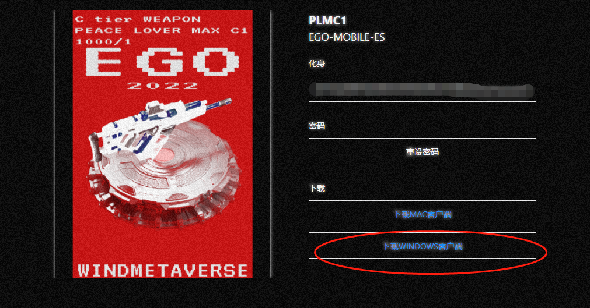

## 16, 等待跳转，如显示404，可点击页面刷新下，正常后保存文件包

## 17, 找到下载好的文件包，解压到文件夹
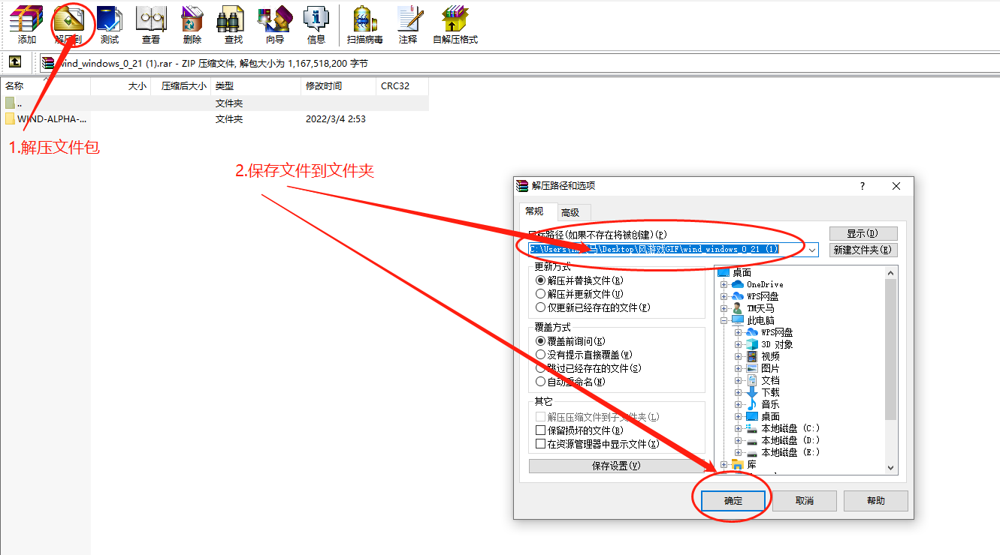

## 18, 再找到解压好的游戏客户端，打开进去游戏界面
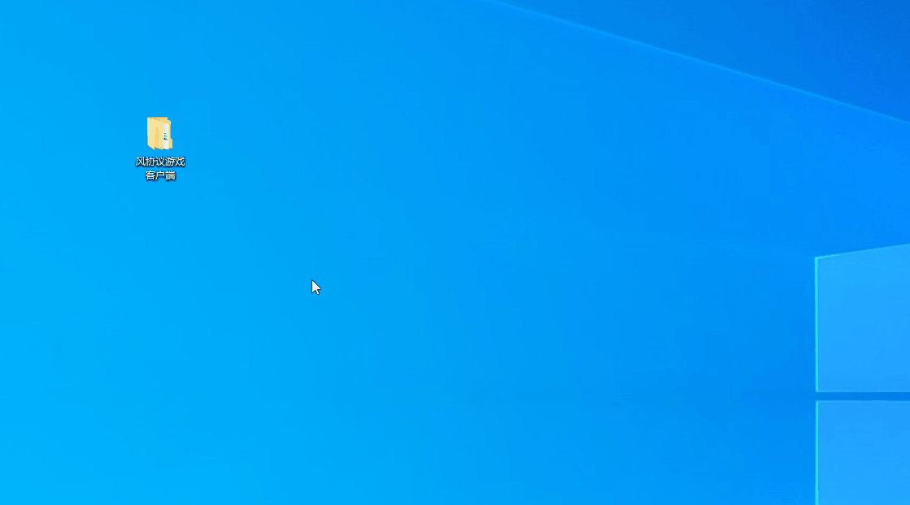

## 19, 输入你的游戏账号（化身）和修改好的[游戏密码](#11%E7%82%B9%E5%87%BB%E4%BF%AE%E6%94%B9%E5%AF%86%E7%A0%81%E5%8C%96%E8%BA%AB%E6%B8%B8%E6%88%8F%E8%B4%A6%E5%8F%B7%E5%92%8C%E4%BF%AE%E6%94%B9%E5%90%8E%E5%AF%86%E7%A0%81%E6%98%AF%E6%B8%B8%E6%88%8F%E5%AE%A2%E6%88%B7%E7%AB%AF%E7%99%BB%E5%BD%95%E4%BF%A1%E6%81%AF%E8%AF%B7%E6%94%B6%E8%97%8F)，登录游戏
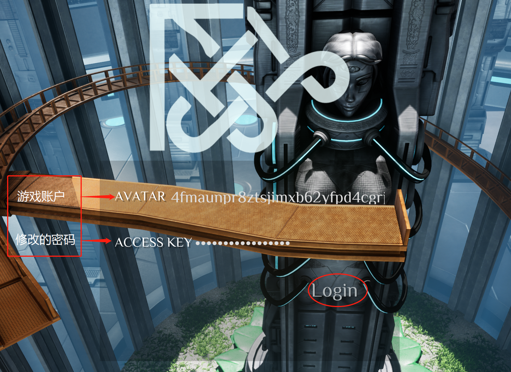

## 20, 等待跳转到这个界面，有2个地图可以选择，点击一个进入
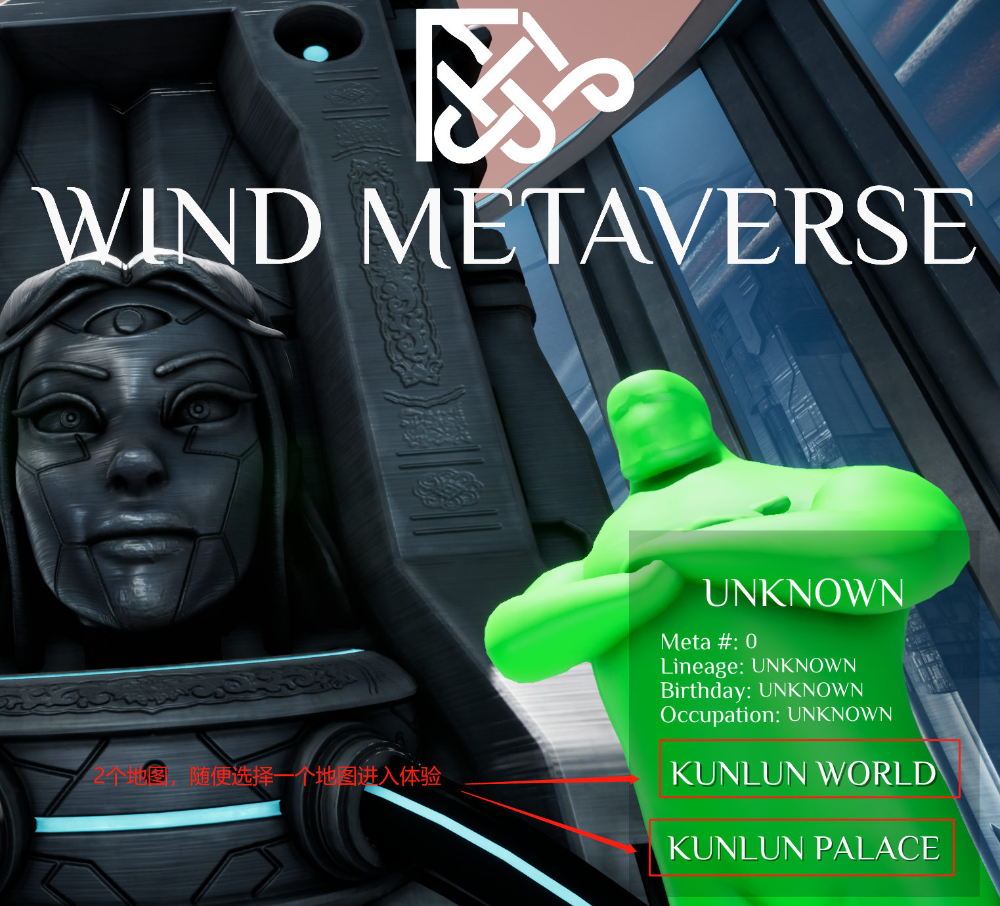

## 21, 进入游戏后的按键操作
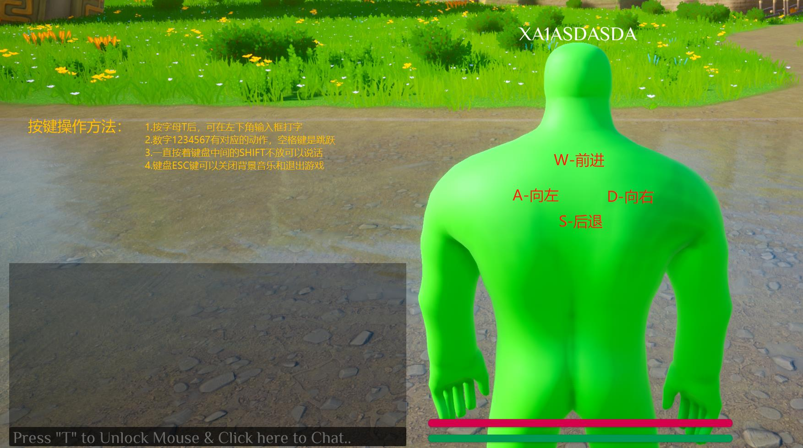