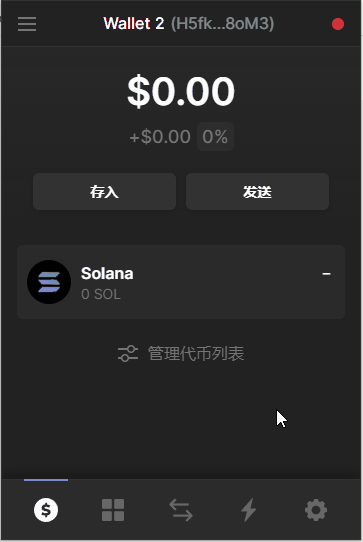

## Windmetaverse-风元宇宙社区-[TTEE快指北](Readme.md)

[**新人问答**](新人问答.md) | [**新人指引**](新人指引.md) | [**NFT市场**](NFT市场.md) | [**游戏攻略**](游戏攻略.md) | [**关键词速递**](关键词速递.md) | [**近期关注**](近期关注.md) | [**账户设置**](账户设置.md) | **领取SOC**

---

(本栏目实验性质, 信息准确度和即时性没有保证. 请以官宣为准. 除非具体说明, 均为北京时间.)
# 参与活动后如何领取💎Solcrystol

领取教程

1.进入[官网](https://windmetaverse.com/) ,点击**Reward**

2.点击链接你的钱包

3.钱包链接成功后，点击**Claim Reward**

4.再次点击钱包的**批准**，等待交互成功。

5.添加SOC的合约地址到钱包：SOC合约地址：**CJze5X3G3V6nqqrfeALTpb1HbkKvspjiUGR12rVchL3T**,点击管理代币列表，粘贴合约地址到搜索栏，点击开启按钮

SOC领取未成功的常见问题解决：

 
1.确认参加官方活动，并在Discord指定频道留有钱包地址

2.确保钱包有足够的SOL用作GAS费用

3.确保钱包地址已经添加SOC合约地址，有时候已经领取成功，但是网页会报错，请检查钱包SOC数量或在[Solscan](https://solscan.io/token/CJze5X3G3V6nqqrfeALTpb1HbkKvspjiUGR12rVchL3T)检查交易记录

4.未领取成功请刷新页面,同时清除浏览器缓存

5.推荐在PC端，使用Chrome浏览器领取
